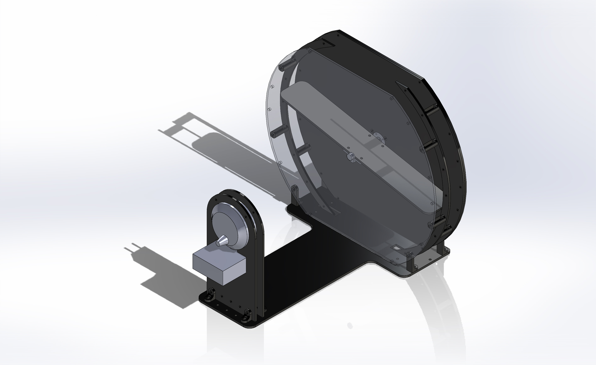

# Balance_pingpong
This is a repo for balancing pingpong ball using camera and dynamixel. 



## Installation

In your project directory, run:
``` 
python -m venv venv 
```

Activate the Virtual Environment,
```
.\venv\Scripts\activate
```
Then install the package as well as opencv: 

```
cd python
python .\setup.py install
cd ../
pip install opencv-python
```

## Structure

- 'python' folder is a copy of dynamixel sdk. You can also get this from [here](https://emanual.robotis.com/docs/en/software/dynamixel/dynamixel_sdk/download/#repository).
- 'scripts' folder contains the test code for the camera and main code. 
- ``pingpong.py`` in scripts folder controls the ping pong ball via dynamixel motor with the camera input.
- 'venv' is the virtual environment for the code. Feel free to add pytorch package to run the RL controller.
- 'design' folder contains the ai file I used for laser cutting as well as the design file of the balancing platform. 

## Code description

``pingpong.py`` controls the pingpong ball from the camera input. For the basic template, you can manipulate ping-pong ball in the camera frame window by pressing following keys: 

- 'q' : turn off the controller
- 'w' : toggle to run/stop the basic PD controller based on the camera input 
- 'e' : rotate the bar counter-clockwise
- 'r' : rotate the bar clockwise


### Running camera

Before first running, we need to change the default camera property. please uncomment following in line 124-131:

```
        # self.cap.set(cv2.CAP_PROP_FRAME_WIDTH, 1280)
        # self.cap.set(cv2.CAP_PROP_FRAME_HEIGHT, 720)
        # self.cap.set(cv2.CAP_PROP_FPS, 60)
        # self.cap.set(cv2.CAP_PROP_FOURCC,cv2.VideoWriter_fourcc('M','J','P','G'))
        # # set the focus to infinity
        # self.cap.set(cv2.CAP_PROP_FOCUS, 0)
        # # make sure auto exposure and auto white balance are turned off
        # self.cap.set(cv2.CAP_PROP_AUTO_EXPOSURE, 0.25)
```
Those setup code slows the startup of the code, so you can re-comment them after setup the camera property.

### Controller 

Main PD controller code are in line 187 - 219. Please feel free to add another controller using variables defined here. 

## Design instruction

The full 3D view or step file of the balancing platform is available in ``design\assem_platform.pdf`` or ``design\assem_platform.STEP``. Corresponding stl files are available in ``design\stl files\``.

### Laser cutting 

The ai file is available to cut the 4 black acrylic board and 1 clear acrylic board. Please use additional part for strenthening the bottom board. 

### Dynamixel assembly instruction

Dynamixel kit come with the power cable, U2D2, and U2D2 Power Hub set.According to [here](https://www.robotis.us/dynamixel-starter-set-us/), you can get detailed instruction. 

**U2D2** is a compact USB communication converter that enables users to control and operate DYNAMIXEL with a computer.

It is smaller than the previous model and has mount holes to make it easier to install on robots. It uses a micro-B USB cable to connect to the user`s computer and prevents damage of the USB terminals. It has both 3-pin connectors for TTL communication and 4-pin connectors for RS-485 communication to allow universal compatibility with any model of DYNAMIXEL.
U2D2 supports direct connections to/from UART as well. To connect DYNAMIXEL models using Molex connectors, ROBOTIS offers "convertible" cables with one Molex and one JST connector compatible with U2D2.

**U2D2 Power Hub Board** combines with the U2D2 to supply a variety of external power sources to DYNAMIXEL units. 
The board is capable of supplying power to all models of DYNAMIXEL using the SMPS port, terminal block, and 2-pin power connector. The board has holes to attach the U2D2 module and it can be attached using plastic rivets supplied in the package. It provides a power switch for a convenient method to turn power ON/OFF.


**SMPS 12V 5A AC Adapter** is a wall plug adapter which can be combined with U2D2 Power Hub Board to provide 12V power to connected devices. 
The SMPS 12V 5A AC Adapter is recommended for use with all 12V DYANMIXELs.


